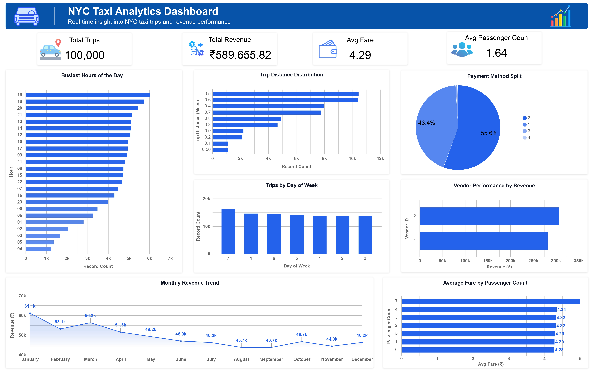

# 🚖 NYC Taxi Analytics Dashboard

<p align="center">
  
  
  
  
</p>

<p align="center">
  <strong>Business Intelligence Project using Google BigQuery (SQL) & Looker Studio</strong>
</p>

---

## 📌 Project Overview

This project analyzes the **NYC Yellow Taxi Trips 2015** dataset using **Google BigQuery (SQL)** and presents business insights through an interactive **Looker Studio Dashboard**.

The project follows a complete analytics workflow—from data exploration and SQL analysis to dashboard development and business reporting.

---

## 🎯 Business Objectives

- Analyze taxi trip data using SQL
- Identify peak operating hours
- Analyze weekly travel patterns
- Monitor monthly revenue trends
- Compare vendor performance
- Study customer payment preferences
- Analyze passenger behavior
- Evaluate trip distance patterns
- Build an interactive Business Intelligence dashboard

---

## 🛠️ Tools & Technologies

| Tool | Purpose |
|------|---------|
| Google BigQuery | SQL Query Execution |
| SQL (Standard SQL) | Data Analysis |
| Looker Studio | Dashboard Development |
| Google Cloud Platform | Public Dataset Access |

---

## 📂 Dataset

**Dataset:** NYC Yellow Taxi Trips 2015

**Source:** Google BigQuery Public Dataset

### Dataset Includes

- Pickup & Drop-off Date/Time
- Trip Distance
- Passenger Count
- Fare Amount
- Total Amount
- Tip Amount
- Payment Type
- Vendor ID
- Pickup Coordinates

---

## 🔄 Project Workflow

```text
NYC Yellow Taxi Dataset
        │
        ▼
 Data Exploration
        │
        ▼
SQL Analysis (BigQuery)
        │
        ▼
 Business Insights
        │
        ▼
Looker Studio Dashboard
        │
        ▼
Business Intelligence Report
```

---

## 📊 SQL Analysis

The project includes the following SQL analyses:

- Sample Data Preview
- Peak Hours Analysis
- Weekly Trend Analysis
- Monthly Revenue Analysis
- Payment Type Analysis
- Trip Distance Analysis
- Vendor Performance Comparison
- Top Pickup Locations
- Average Fare by Passenger Count

---

## 📈 Dashboard Features

- ✅ Total Trips
- ✅ Total Revenue
- ✅ Average Fare
- ✅ Busiest Hours of the Day
- ✅ Trips by Day of Week
- ✅ Monthly Revenue Trend
- ✅ Payment Method Distribution
- ✅ Vendor Performance
- ✅ Average Fare by Passenger Count
- ✅ Trip Distance Distribution

---

## 🖼️ Dashboard Preview

<p align="center">
  
</p>

---

## 💡 Key Insights

- Identified peak taxi demand hours.
- Analyzed weekly travel patterns.
- Compared monthly revenue performance.
- Evaluated payment preferences.
- Compared vendor performance.
- Studied passenger behavior.
- Analyzed trip distance distribution.
- Developed an interactive Business Intelligence dashboard.

---

## 📁 Repository Structure

```text
nyc-taxi-analytics-dashboard/
│
├── README.md
├── LICENSE
├── .gitignore
│
├── data/
│   └── sql_queries.sql
│
├── dashboard/
│   ├── dashboard.png
│   └── dashboard.pdf
│
└── report/
    └── Business_Intelligence_Report.pdf
```

---

## 🚀 Future Enhancements

- Add interactive dashboard filters
- Create pickup and drop-off heat maps
- Build a real-time dashboard
- Perform demand forecasting using Machine Learning
- Compare multiple years of taxi data
- Enable automatic dashboard refresh

---

## 📄 Report

The complete Business Intelligence Report is available in:

`report/Business_Intelligence_Report.pdf`

---

## 📜 License

This project is licensed under the **MIT License**.

---

## 👨‍💻 Author

**Ravsaheb Bansode**

Aspiring Data Analyst

- LinkedIn: https://www.linkedin.com/in/ravsaheb-bansode/
- Portfolio: https://ravsaheb-bansode-portfolio.vercel.app/
- Email: bansoderav@gmail.com

---

## ⭐ Support

If you found this project useful, consider giving it a ⭐ on GitHub.